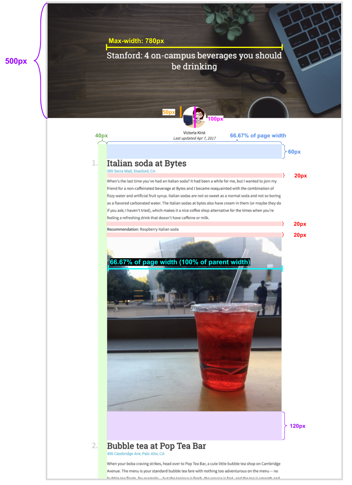

# Part1  Homework 2: Listicle

Please complete two webpages:
- Modify **listicle.html** and **css/listicle-style.css** to replicate the "On-campus Beverages" article that we provided as accurately as you can.
- Modify **my-list.html** and **css/my-list-style.css** to create your own list article and style it however you'd like!

### See the [Homework 2 spec] for more detail


1. Here is the full screenshoot you need to create. 


```
Note: you do not have to type in the contents of the page.
```
- The text of the article is contained within `listicle-content.txt`, which is included in your Homework 2 starter code.

- Copy and paste the text of `listicle-content.txt` into your `listicle.html` file, then add the HTML tags necessary to style the page. 

- The images are also in the images/ directory of the `Homework 2` starter code.


2. Section measurements




3. Font faces, sizes, and colors

**Page Title**: 


- The font face is `'Roboto Slab'` and the fallback font is serif.

- The font size is `36px`.

- The font weight is `normal` (not bold).

- The font color is `white`.

- The title is vertical and center aligned to the header image.


**Profile Text**:


- The font face is `Source Sans Pro` and the fallback font is `sans-serif`.

- The font size is `18px`.

- The font weight for the author name (“Victoria Kirst”) is `bold`

- The font style for the last updated (“Last updated Apr 7, 2017”) is `italic`.

- The font color is `rgb(51, 51, 51)`.
- The line height `24px`.
- The gray line under the “Last updated” line is `10px` under the text, `2px` wide, and the color is `#e6e6e6`.

**Body**: 


- Heading
    
    - The font face is `Roboto Slab` and the fallback font is `serif`.
    
    - The font size is `36px`.

    - The font weight is `bold`.

    - The number’s color is `rgba(0, 0, 0, 0.25)`.
    
    - The title color is `rgb(51, 51, 51)`.

- Paragraph 

    - The font face is `Source Sans Pro` and the fallback font is `sans-serif`.

    - The font size is `18px`.
    
    - The line height `32px`.

    - The font color is `rgb(51, 51, 51)`.


- Recomendation 
    
    - The phrase “Recommendation:” is `bold`.


4. Link 

Here is a description of how links should work on your page: 

-  Each address of the page is a link. The URL for each link is listed in `listicle-content.txt`.

- The link color is `#42b4d6`.

- The link is not bold, and the link is not underlined unless you hover over the link.
- When you hover over the link, the link becomes underlined.

- Hints:

    - To remove an underline, you can use CSS property  `text-decoration: none`;
    - To add an underline, you can use CSS property `text-decoration: underline`;

5. Image 

- Header image

    - The header is a background image (`images/header.jpg`).
        - **Note**: To reference the image from the css/ folder, the path needs to be `../images/header.jpg`
    - The background does not repeat.

    - The background’s size is set to cover.
    
    - The background position is anchored to the top.
    
    - Its height is 500px.
    
    - There is a semi-transparent color overlay on top of the header image, which is rgba(0, 0, 0, .3)
        - You can achieve this using the following CSS rule:

        `background-image: linear-gradient(rgba(0, 0, 0, .3), rgba(0, 0, 0, .3)), url(../images/header.jpg);`

- Profile Image: 

    - The profile image is `images/vrk.png`
        - **Note**: To reference the image from the css/ folder, the path needs to be `../images/vrk.png`
    
    - Its width is 100px.

    - It has rounded corners with radius 100%.

    - It has a white border that is 1px thick.

## HTML and CSS style requirements 

For full credit, please abide by the following:

- **Use HTML and CSS we’ve learned in class**. You should be able to complete this homework using HTML and CSS we’ve learned in class. While you are not strictly forbidden from using HTML/CSS we haven’t talked about in class, if you use it incorrectly or if you make poor stylistic choices, you may be marked down.

- **Do not use JavaScript**. There’s no need to use JavaScript in this assignment.

- **Respect Separation of Concerns**. Your HTML should describe the content of your page, and your CSS should describe your page’s appearance.

- Follow the best practices that were described in lecture and in the mini-homework.

- **Reduce redundancy in CSS**. Try not to have too many redundant styles, if there are ways to use inheritance or special selectors to concisely define style rules.

- **Match the given appearance as closely as possible**. It’s fine if your web page is off from our description by a few pixels here and there, but noticeable differences may result in a lower homework score.

- **Use descriptive names, consistent spacing**, and otherwise follow good code hygiene.


=================================================================================
# Part2:  Your Listicle 

Design your own listicle! You should write the content in `my-list.html` and the style in `my-list-style.css`.

For full credit, please abide by the following:

- Cannot be an exact line-for-line copy of `listicle.html`
- Must have at least 3 items in your list
- Must correctly use `display: flex` at least once.
- You can, but do not have to, refer to `listicle-style.css`.

You can spend as much or as little time on this part as you want, provided that your page does fall within the guidelines above.


###Submit 

    Deploy Your completed homework to your firbase